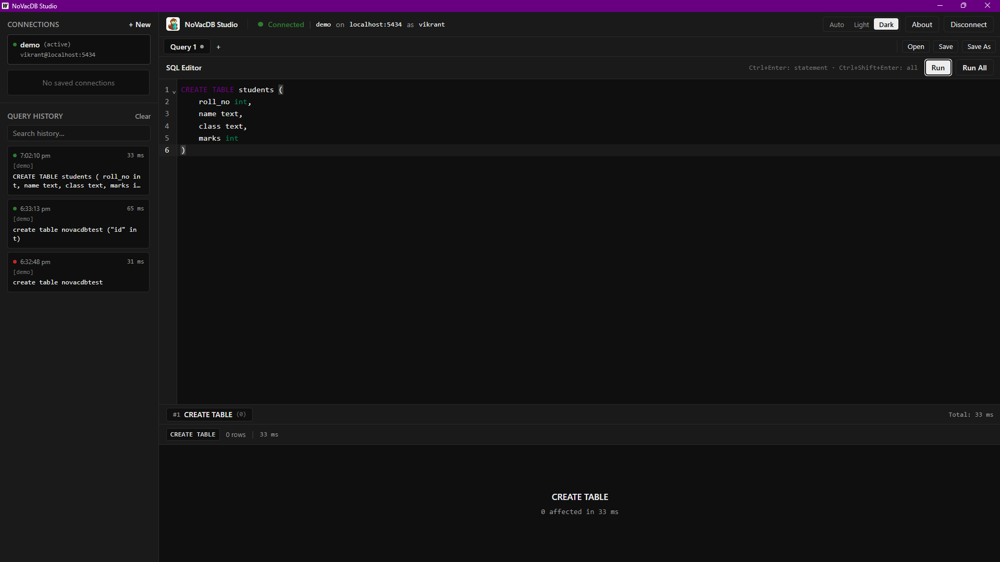
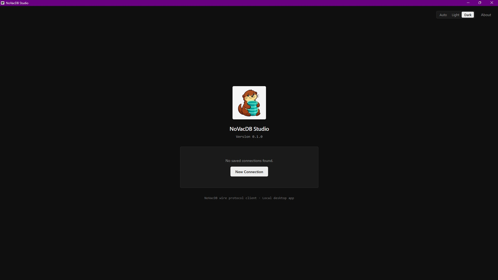
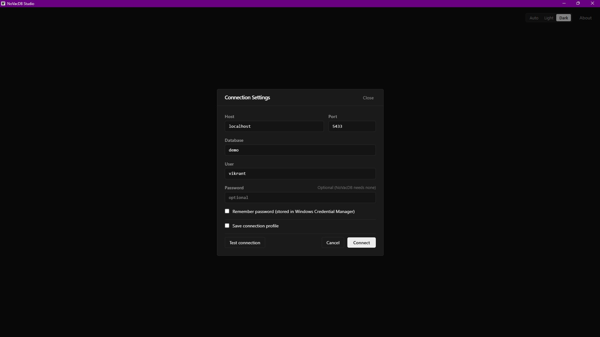
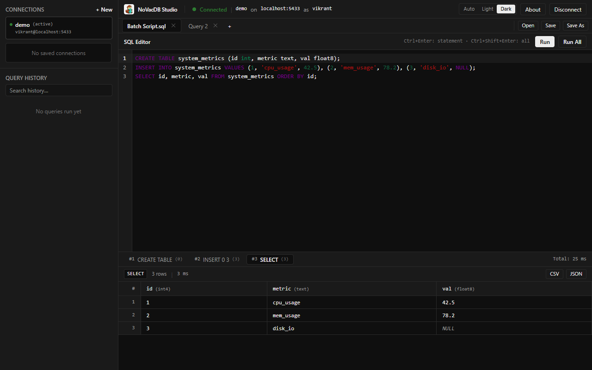
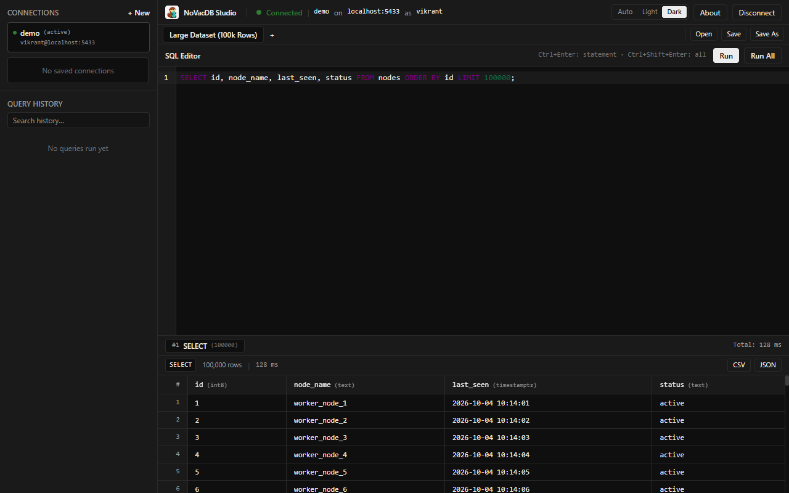
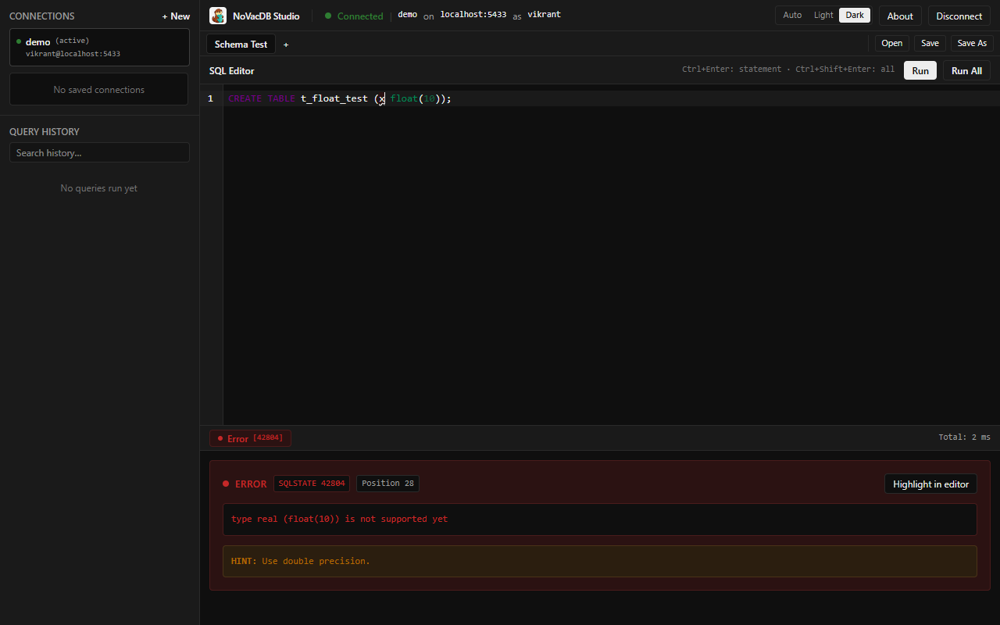
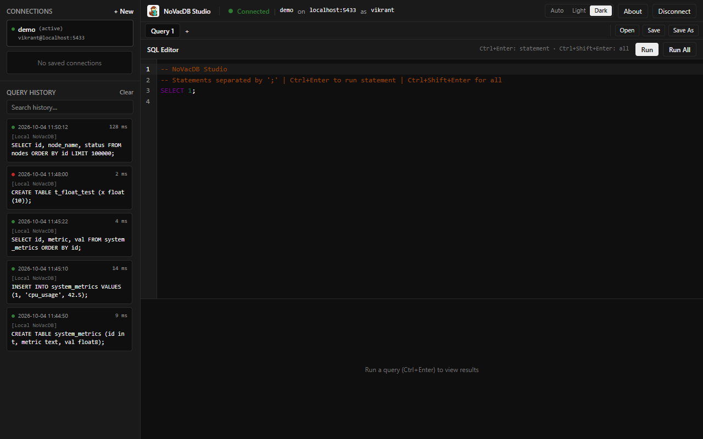

# NoVacDB Studio


A desktop SQL client for NoVacDB (and PostgreSQL).



## Screenshots

- **Start screen**: centered logo, version indicator, saved connections list, and connection launcher.
  

- **Connection settings**: host, port, user, database, and optional password with Windows Credential Manager integration.
  

- **Multi-statement execution**: individual result tabs for each statement in a batch script.
  

- **Results grid**: virtualized row scrolling supporting up to 100,000 rows, data type headers, and export actions.
  

- **Server error reporting**: full error details including SQLSTATE, message, character position highlight, and HINT.
  

- **Query history**: local persistent log of executed queries with timestamps, execution durations, and reload support.
  

## Features

- **SQL editor**: CodeMirror 6 editor with SQL syntax highlighting, line numbers, bracket matching, and multiple editor tabs. Unsaved text is preserved across app restarts.
- **Execution controls**: run selection or statement under cursor (`Ctrl+Enter`), or run the entire editor (`Ctrl+Shift+Enter`).
- **Query cancellation**: cancel running queries without freezing the UI or dropping the main connection using PostgreSQL wire protocol CancelRequest.
- **Results grid**: virtualized table for smooth scrolling with datasets up to 100,000 rows, column data types in headers, distinct representation for `NULL` values, and cell value inspector.
- **Data export and copy**: copy selected cells as tab-separated values (TSV) for spreadsheets, and export full result sets to CSV or JSON files.
- **Server errors**: detailed error reporting displaying severity, SQLSTATE error code, message, character position underline in the editor, and server `DETAIL` and `HINT` fields.
- **Saved connections**: manage connection profiles locally. Passwords are saved in Windows Credential Manager rather than plain text, or prompted per session if unticked.
- **Query history**: searchable local history storing up to 1,000 executed queries with execution time, duration, and status.
- **Themes**: neutral monochrome interface supporting light and dark themes, following system preference by default.

## Requirements

- Windows 10/11 64-bit
- Microsoft Edge WebView2 Runtime (preinstalled on Windows 11)
- A running NoVacDB server (or PostgreSQL server)

## Install

Download `NoVacDB-Studio.exe` from the GitHub Releases page.

When launching the application for the first time, Windows SmartScreen may show a warning:
> "Windows protected your PC"

Click **More info**, then click **Run anyway**. This warning appears because the executable is not code-signed with a commercial certificate.

## Connect to NoVacDB

NoVacDB currently runs on Linux and WSL. To build and run NoVacDB in WSL:

```bash
cd ~/NoVacDB && make build
./bin/novacdb --data-dir ~/novacdb-data --port 5433
```

For more information on the database engine itself, visit the [NoVacDB repository](https://github.com/NoVacDB/NoVacDB).

In NoVacDB Studio, use the following default connection parameters:
- **Host**: `localhost`
- **Port**: `5433`
- **User**: your username (e.g. `vikrant`)
- **Database**: your database name (e.g. `demo`)
- **Password**: leave blank (NoVacDB uses trust authentication on localhost; password authentication is planned)

## Also works with PostgreSQL

NoVacDB Studio communicates using the standard PostgreSQL wire protocol. You can connect it to standard PostgreSQL servers by specifying your host, port (typically 5432), user, database, and password.

## Keyboard shortcuts

| Shortcut | Action |
|---|---|
| `Ctrl+Enter` | Run statement under cursor or selected text |
| `Ctrl+Shift+Enter` | Run all statements in the editor |
| `Escape` | Cancel currently running query |
| `Ctrl+T` | Open a new query tab |
| `Ctrl+W` | Close the active query tab |
| `Ctrl+O` | Open a `.sql` file from disk |
| `Ctrl+S` | Save current query to file |
| `Ctrl+Shift+S` | Save current query as a new file |
| `Ctrl+C` | Copy selected cell(s) in result grid as TSV |

## Build from source

Prerequisites:
- [Go](https://go.dev/) 1.25+ (configured in `go.mod`)
- [Node.js](https://nodejs.org/) LTS (18+)
- [Wails CLI v2](https://wails.io/)

Commands:

```bash
# Run in development mode with hot reload
wails dev

# Build the standalone Windows executable
wails build -clean -platform windows/amd64
```

The resulting executable is generated at `build/bin/NoVacDB-Studio.exe`.

## Roadmap

The following capabilities will be introduced as the NoVacDB engine adds protocol and catalog support:
- **Schema and table browser**: catalog inspection once system catalog tables are implemented.
- **Transaction management controls**: `BEGIN`, `COMMIT`, and `ROLLBACK` actions once transaction boundaries are supported over the wire.
- **Query plan viewer**: visual and textual plan inspection once `EXPLAIN` support is added to the engine.

## License

No license file is currently present in the repository.
